<!-- markdownlint-disable MD033 MD041 -->
<p align="center">
  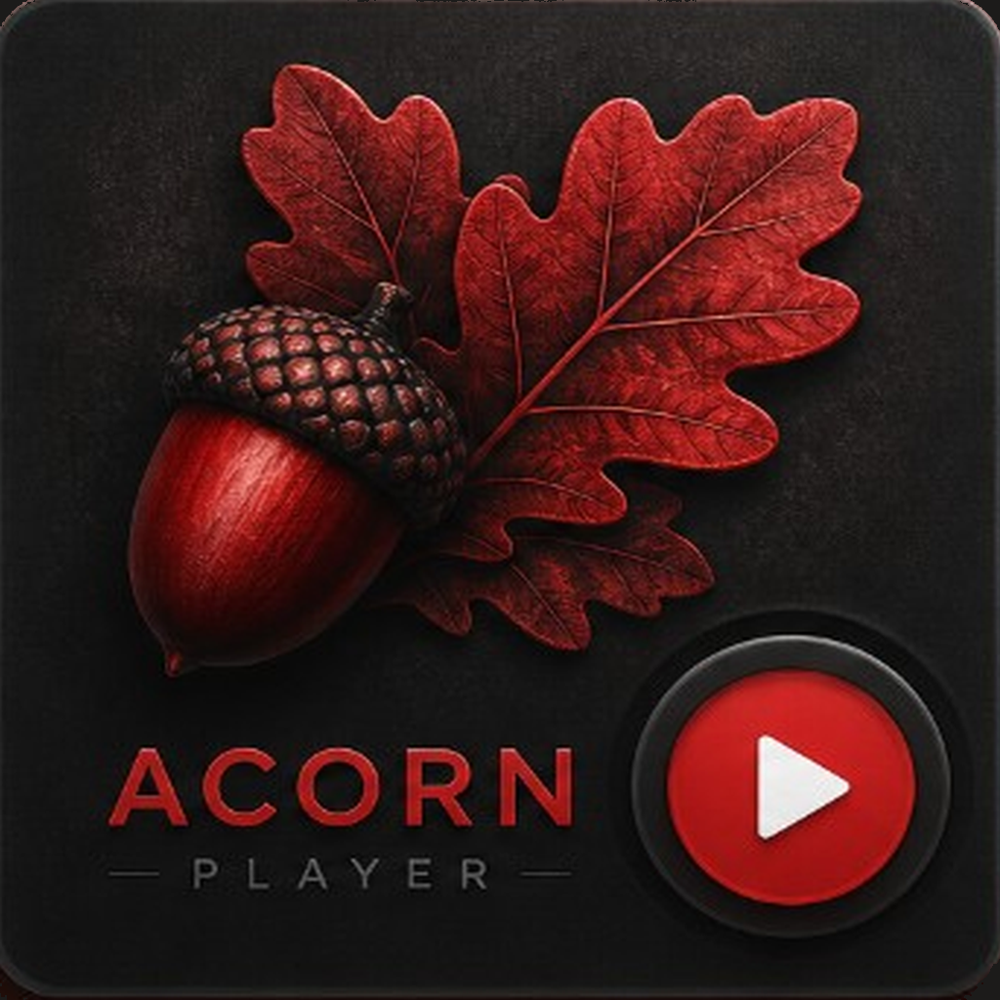
</p>

<h1 align="center">Acorn Player</h1>

<p align="center">
  <strong>Play it locally.</strong><br/>
  <sub>Neumorphic music player for Linux · Windows · macOS · Android · iOS — Flutter · just_audio · Drift</sub>
</p>

<p align="center">
  <a href="https://github.com/acornassociated-22/AcornPlayer/releases/latest"></a>
  <a href="https://github.com/acornassociated-22/AcornPlayer/stargazers"></a>
</p>

<p align="center">
  <a href="https://github.com/acornassociated-22/AcornPlayer/releases/latest/download/acorn-player_1.2.1.apk"></a><br/>
  <a href="https://github.com/acornassociated-22/AcornPlayer/releases/latest/download/acorn-player_1.2.1_amd64.deb"></a><br/>
  <a href="https://github.com/acornassociated-22/AcornPlayer/releases/latest/download/acorn-player_1.2.1_windows_x64_setup.exe"></a><br/>
  <a href="https://github.com/acornassociated-22/AcornPlayer/releases/latest/download/acorn-player_1.2.1_macos.dmg"></a><br/>
  <a href="https://github.com/acornassociated-22/AcornPlayer/releases/latest/download/acorn-player_1.2.1_ios_unsigned.ipa"></a>
</p>

<p align="center">
  <a href="https://github.com/acornassociated-22/AcornPlayer/releases/latest"><strong>⬇ Download latest release</strong></a>
  &nbsp;·&nbsp;
  <a href="#-download">Packages</a>
  &nbsp;·&nbsp;
  <a href="#-mobile">Mobile</a>
  &nbsp;·&nbsp;
  <a href="#-screens">Desktop</a>
  &nbsp;·&nbsp;
  <a href="#-build-from-source">Build</a>
  &nbsp;·&nbsp;
  <a href="#-support--acorn-associated">Support</a>
</p>

<p align="center">
  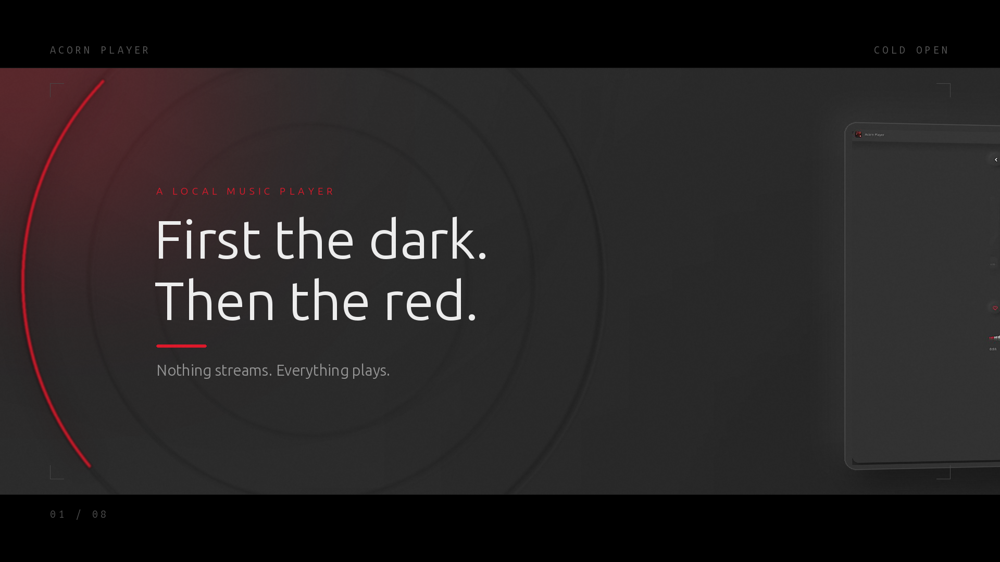
</p>

---

## ⚡ Download

<table>
  <thead>
    <tr>
      <th align="left">Platform</th>
      <th align="left">Package</th>
      <th align="center">Version</th>
      <th align="left">Get it</th>
    </tr>
  </thead>
  <tbody>
    <tr>
      <td><strong>Linux</strong> (x64)</td>
      <td><code>.deb</code></td>
      <td align="center">1.2.1</td>
      <td><a href="https://github.com/acornassociated-22/AcornPlayer/releases/latest/download/acorn-player_1.2.1_amd64.deb"><strong>Download .deb</strong></a></td>
    </tr>
    <tr>
      <td><strong>Linux</strong> (portable)</td>
      <td><code>.tar.gz</code></td>
      <td align="center">1.2.1</td>
      <td><a href="https://github.com/acornassociated-22/AcornPlayer/releases/latest/download/acorn-player_1.2.1_linux_x64.tar.gz">Download archive</a></td>
    </tr>
    <tr>
      <td><strong>Android</strong> (universal)</td>
      <td><code>.apk</code></td>
      <td align="center">1.2.1</td>
      <td><a href="https://github.com/acornassociated-22/AcornPlayer/releases/latest/download/acorn-player_1.2.1.apk"><strong>Download APK</strong></a></td>
    </tr>
    <tr>
      <td><strong>Windows</strong> (x64)</td>
      <td><code>.exe</code> setup · <code>.zip</code></td>
      <td align="center">1.2.1</td>
      <td><a href="https://github.com/acornassociated-22/AcornPlayer/releases/latest/download/acorn-player_1.2.1_windows_x64_setup.exe"><strong>Download .exe</strong></a></td>
    </tr>
    <tr>
      <td><strong>macOS</strong></td>
      <td><code>.dmg</code></td>
      <td align="center">1.2.1</td>
      <td><a href="https://github.com/acornassociated-22/AcornPlayer/releases/latest/download/acorn-player_1.2.1_macos.dmg"><strong>Download .dmg</strong></a></td>
    </tr>
    <tr>
      <td><strong>iOS</strong></td>
      <td><code>.ipa</code> unsigned</td>
      <td align="center">1.2.1</td>
      <td><a href="https://github.com/acornassociated-22/AcornPlayer/releases/latest/download/acorn-player_1.2.1_ios_unsigned.ipa"><strong>Download .ipa</strong></a></td>
    </tr>
  </tbody>
</table>

> macOS and iOS builds are **unsigned**. On macOS open with right-click → **Open**, or run `xattr -dr com.apple.quarantine "/Applications/Acorn Player.app"`. The iOS `.ipa` needs sideloading (Sideloadly / AltStore) with your own signing identity.

---

## ✨ Features

<table>
  <tr>
    <td width="50%" valign="top">
      <h3>🎵 Local first</h3>
      <ul>
        <li>Scan folders — no account, no cloud, no tracking</li>
        <li>Drift (SQLite) library with instant search</li>
        <li>Embedded cover art & metadata reading</li>
        <li>Your files never leave the device</li>
      </ul>
    </td>
    <td width="50%" valign="top">
      <h3>🎛 Soft-UI player</h3>
      <ul>
        <li>Neumorphic surfaces, red accent, dark by design</li>
        <li>Vinyl cards with a progress ring on the platter</li>
        <li>Waveform seek bar & radial volume dial</li>
        <li>Shuffle · repeat · speed controls</li>
      </ul>
    </td>
  </tr>
  <tr>
    <td valign="top">
      <h3>🖥 Desktop native</h3>
      <ul>
        <li>Frameless window with custom title bar</li>
        <li>System volume integration on Linux</li>
        <li>libmpv audio backend via <code>just_audio_media_kit</code></li>
      </ul>
    </td>
    <td valign="top">
      <h3>📱 Mobile ready</h3>
      <ul>
        <li>Same library engine on Android & iOS</li>
        <li>Swipeable album carousel</li>
        <li>Adaptive launcher icon</li>
      </ul>
    </td>
  </tr>
</table>

---

## 📱 Mobile

<p align="center">
  <strong>Nothing streams. Everything plays.</strong><br/>
  <sub>Favorites · Repeat · Shuffle · Speed · System volume</sub>
</p>

<p align="center">
  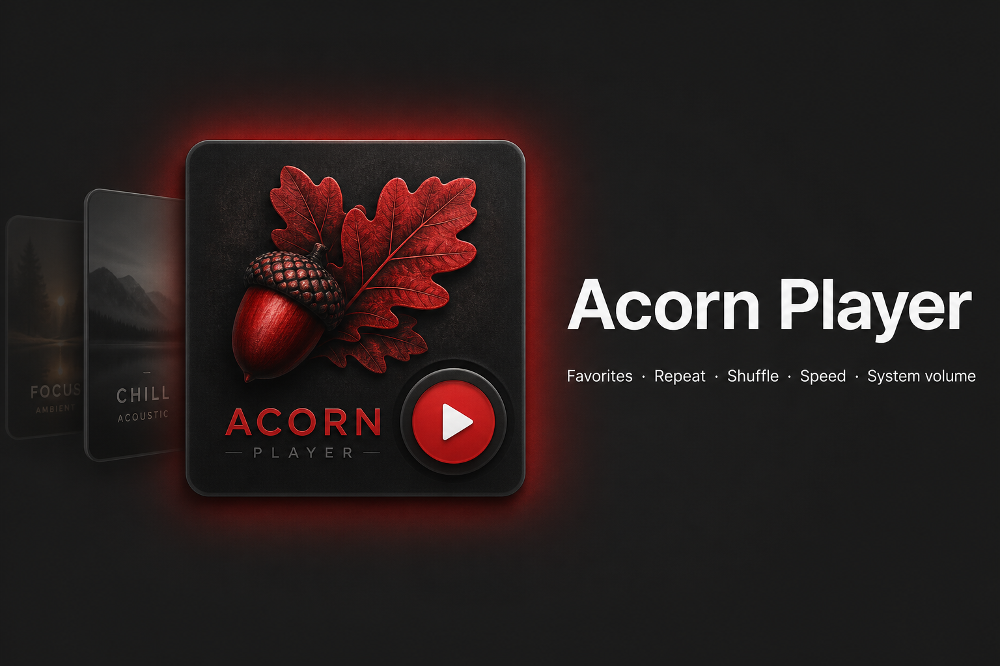
</p>

<table>
  <tr>
    <td width="50%" align="center" valign="top">
      <b>Save what you love.</b><br/>
      <sub>Favorites · library · now playing bar</sub><br/><br/>
      <a href="promo/promo-library-story.png">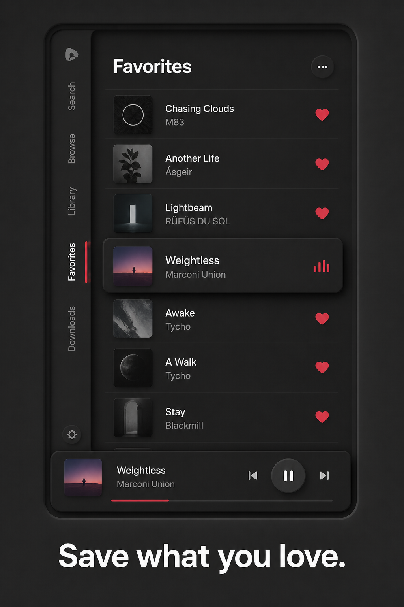</a>
    </td>
    <td width="50%" align="center" valign="top">
      <b>Swipe it. Tap the sides. Shuffle it.</b><br/>
      <sub>Carousel · waveform · red play</sub><br/><br/>
      <a href="promo/promo-now-playing-story.png">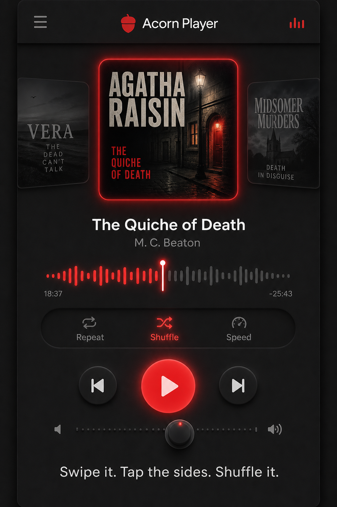</a>
    </td>
  </tr>
</table>

<p align="center">
  <a href="https://github.com/acornassociated-22/AcornPlayer/releases/latest/download/acorn-player_1.2.1.apk"></a>
  &nbsp;
  <a href="https://github.com/acornassociated-22/AcornPlayer/releases/latest/download/acorn-player_1.2.1_ios_unsigned.ipa"></a>
</p>

---

## 📸 Screens

<table>
  <tr>
    <td width="50%" align="center">
      <b>Library</b><br/>
      <a href="promo/promo-02-library.png">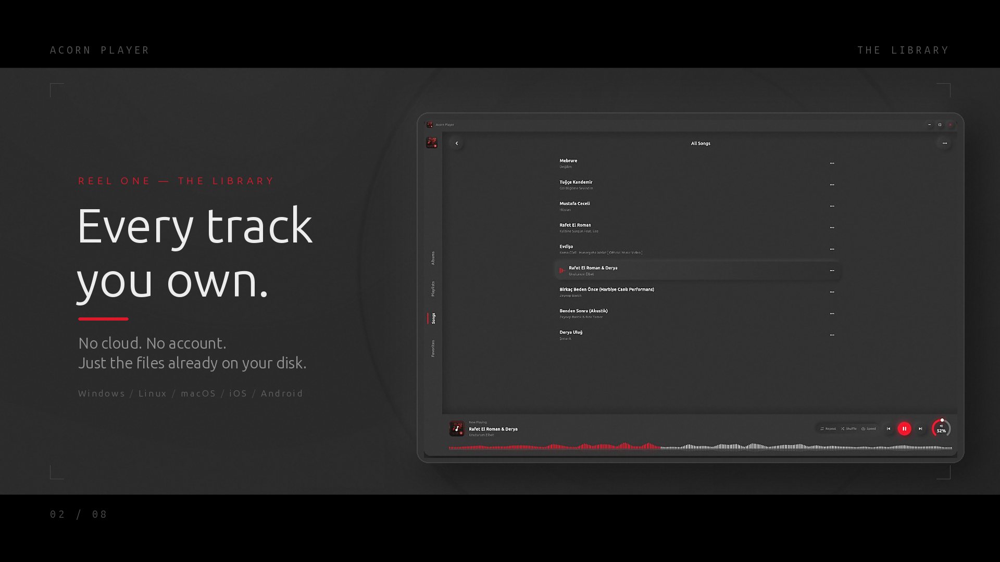</a>
    </td>
    <td width="50%" align="center">
      <b>Now playing</b><br/>
      <a href="promo/promo-03-now-playing.png">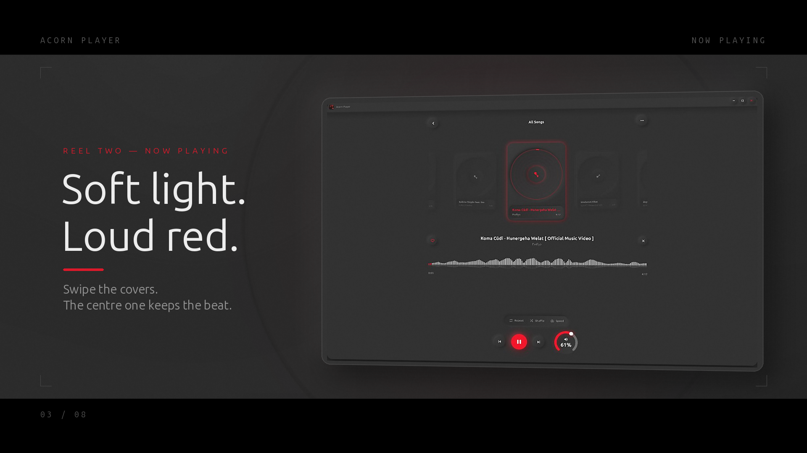</a>
    </td>
  </tr>
  <tr>
    <td align="center">
      <b>Vinyl platter</b><br/>
      <a href="promo/promo-04-platter.png">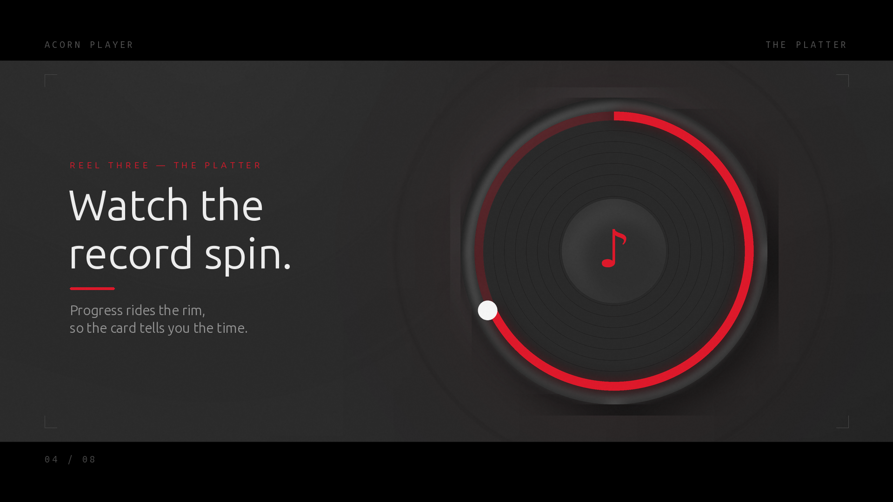</a>
    </td>
    <td align="center">
      <b>Grid</b><br/>
      <a href="promo/promo-05-grid.png">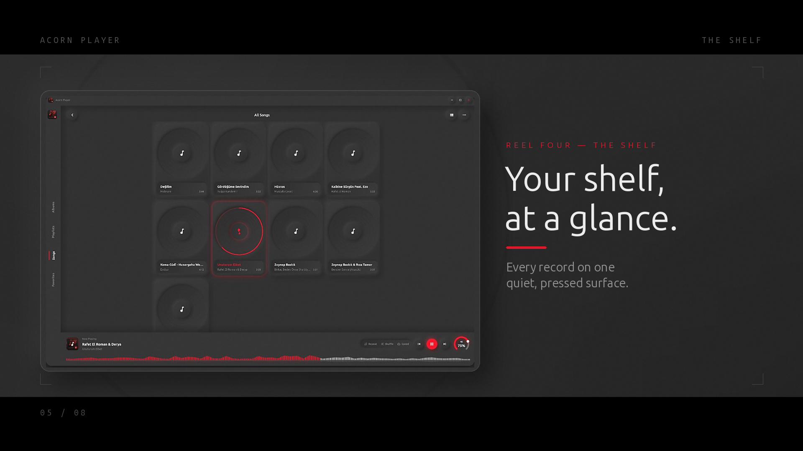</a>
    </td>
  </tr>
  <tr>
    <td align="center">
      <b>In motion</b><br/>
      <a href="promo/promo-06-in-motion.png">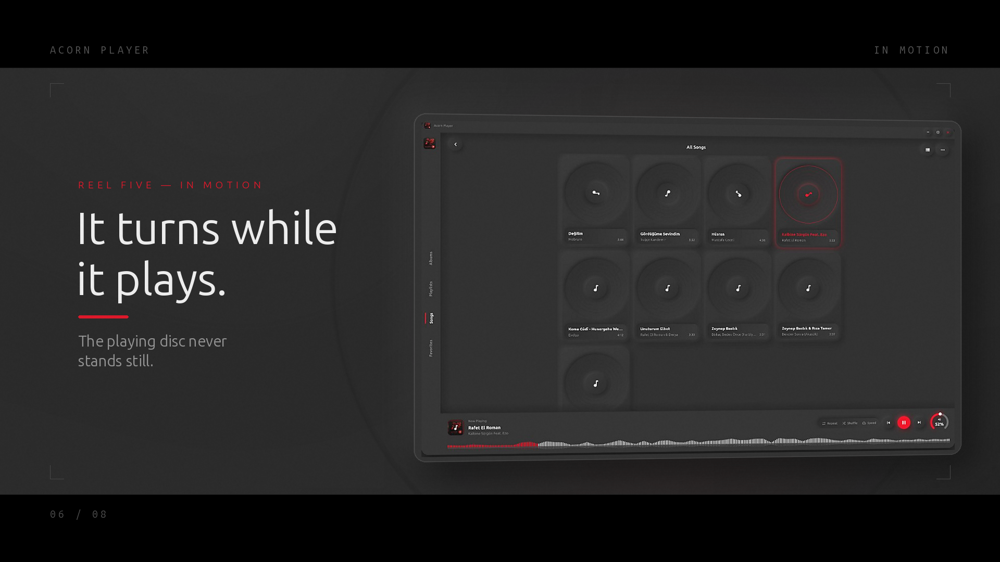</a>
    </td>
    <td align="center">
      <b>Five platforms</b><br/>
      <a href="promo/promo-07-platforms.png">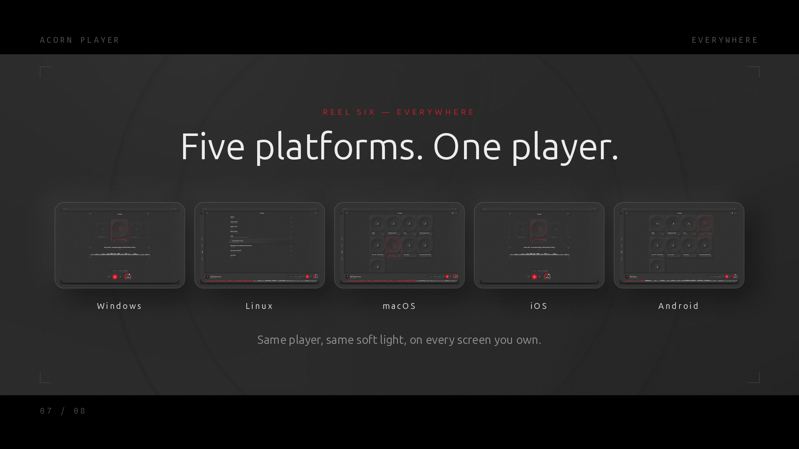</a>
    </td>
  </tr>
</table>

<p align="center">
  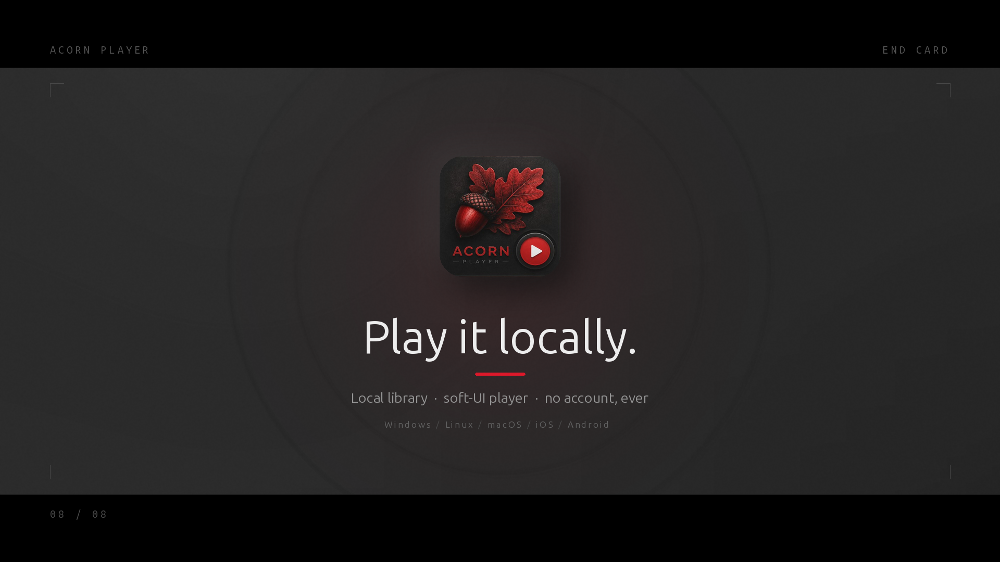
</p>

---

## 🚀 Quick start

<details open>
<summary><strong>Linux</strong></summary>

```bash
sudo apt install ./acorn-player_1.2.1_amd64.deb
acorn-player
```

Or use the portable archive: extract and run `./install.sh` (per-user) or `./acorn_player` directly. Requires `libmpv2` and GTK 3.

</details>

<details>
<summary><strong>Android</strong></summary>

1. Download the **[APK](https://github.com/acornassociated-22/AcornPlayer/releases/latest/download/acorn-player_1.2.1.apk)** and allow install from unknown sources.
2. Open Acorn Player → grant audio permission → pick your music folder.

</details>

<details>
<summary><strong>Windows · macOS</strong></summary>

- **Windows:** run the setup `.exe`, or unzip the portable build and start `acorn_player.exe`.
- **macOS:** open the `.dmg`, drag **Acorn Player** to Applications, then right-click → **Open** the first time.

</details>

---

## 🛠 Build from source

```bash
git clone https://github.com/acornassociated-22/AcornPlayer.git
cd AcornPlayer
flutter pub get
flutter run -d linux            # or: -d windows, -d macos, -d <device>

./scripts/package-linux.sh      # .deb + .tar.gz into releases/
./scripts/package-android.sh    # universal .apk into releases/
```

Requirements: Flutter 3.44+, Dart 3.12+. Linux also needs `libmpv-dev`, `libgtk-3-dev`, `ninja-build`, `clang`; Android needs JDK 17 and the Android SDK.

---

## 🧩 Tech stack

| Layer | Stack |
|:--|:--|
| UI | Flutter · custom neumorphic widgets |
| Audio | just_audio · just_audio_media_kit (libmpv) |
| Data | Drift (SQLite) · audio_metadata_reader |
| State | provider |
| Desktop | window_manager · frameless GTK/Win32/Cocoa shell |
| CI | GitHub Actions — Linux · Windows · macOS · Android · iOS |

---

## 💜 Support & Acorn Associated

<p align="center">
  <a href="https://www.acornik.com"><strong>Acornik.com</strong></a>
  &nbsp;·&nbsp;
  <a href="https://acornassociated.org/"><strong>acornassociated.org</strong></a>
</p>

<p align="center"><em>Empowering minds. Building tech capacity.</em> · Qamishli</p>

<details open>
<summary><strong>📧 Contact</strong></summary>

| | |
|---|---|
| Info | [Info@acornassociated.org](mailto:Info@acornassociated.org) |
| Sales | [Sales@acornassociated.org](mailto:Sales@acornassociated.org) |
| Support | [Support@acornassociated.org](mailto:Support@acornassociated.org) |
| PayPal | [acornassociatedorg@gmail.com](mailto:acornassociatedorg@gmail.com) |

[Open an issue](https://github.com/acornassociated-22/AcornPlayer/issues) · bug reports welcome

</details>

<details>
<summary><strong>🌐 Social media</strong></summary>

<p align="center">
  <a href="https://www.facebook.com/share/1BHdij74U4/">Facebook</a> ·
  <a href="https://x.com/Acornassociate2">X</a> ·
  <a href="https://www.instagram.com/acornassociated">Instagram</a> ·
  <a href="https://youtube.com/@acornassociated">YouTube</a> ·
  <a href="https://t.me/acornassociated">Telegram</a> ·
  <a href="https://www.linkedin.com/in/acorn-associated-4715b4424">LinkedIn</a> ·
  <a href="https://github.com/acornassociated-22">GitHub</a> ·
  <a href="https://medium.com/@social_3025">Medium</a> ·
  <a href="https://www.reddit.com/user/Acorn_Associated">Reddit</a> ·
  <a href="https://pin.it/6aHftNn8p">Pinterest</a>
</p>

</details>

<details>
<summary><strong>❤️ Donate</strong></summary>

**Card (Stripe — no PayPal account needed)**

| Amount | Link |
|:--:|:--|
| **$5** | [Stripe →](https://donate.stripe.com/test_6oU6oH2ac2dpaOl9uRfQI00) |
| **$10** | [Stripe →](https://donate.stripe.com/test_5kQ28r168dW71dLgXjfQI01) |
| **$100** | [Stripe →](https://donate.stripe.com/test_14A6oH6qs7xJbSp9uRfQI03) |
| **Other** | [Custom amount →](https://donate.stripe.com/test_3cI4gzg1219lcWtfTffQI02) |

**PayPal:** [acornassociatedorg@gmail.com](mailto:acornassociatedorg@gmail.com) · [Send Money →](https://www.paypal.com/myaccount/transfer/send/?recipient=acornassociatedorg%40gmail.com&currencyCode=USD&note=Acorn+Associated+support)

</details>

---

<p align="center">
  <sub>© Acorn Associated · Built by <strong>Erik</strong> · All rights reserved</sub>
</p>
